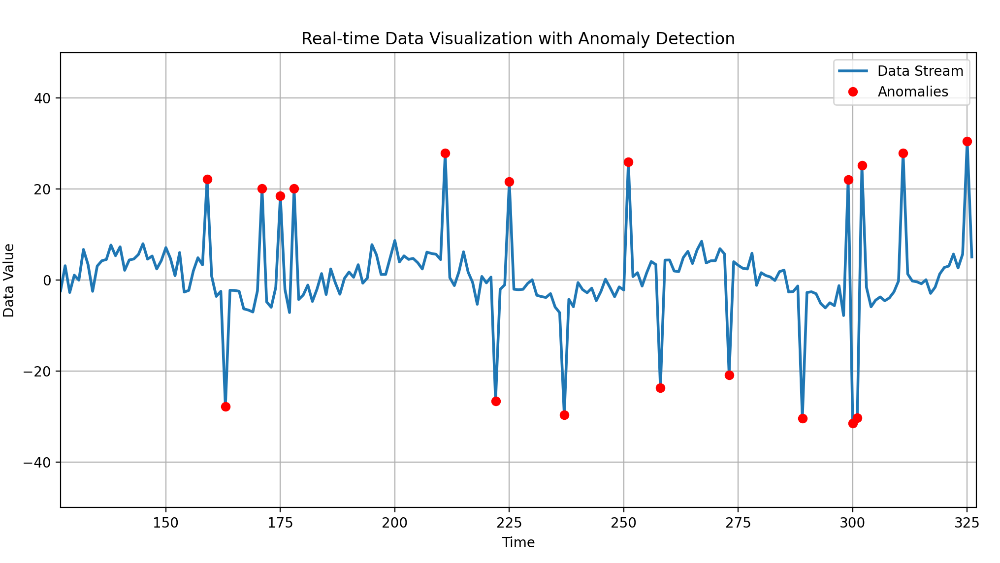

# Data-Stream-Anomaly-Detection

 <!-- Adjust the path to your image -->


This project implements a real-time anomaly detection system that visualizes data streams while detecting anomalies using various statistical methods. It features a dynamic data generator, an anomaly detection system with multiple detection algorithms, and a live visualizer for monitoring data and detected anomalies.

## Project Structure

```
.
├── anomaly_detector.py  # Contains classes for different anomaly detection strategies.
├── data_point.py       # contains the base component (data point)
├── data_streamer.py     # Generates a stream of data points with optional anomalies.
├── data_validation_error.py # Contains a custom exception
├── data_visualizer.py    # Handles the visualization of data and anomalies.
├── main.py              # Main script to run the application.
├── requirements.txt      # List of required packages.
└── README.md            # Project documentation.
```

## Classes Overview

- **DataPoint**: Represents a single data point with a time and value.
- **DataValidationError**: Represents a custom exception for our project.
- **DataStreamer**: Generates data points that simulate a seasonal signal with noise and occasional anomalies.
- **AnomalyDetector**: Abstract base class for implementing different anomaly detection strategies.
  - **ZScoreDetector**: Detects anomalies based on the Z-score method. It measures how many standard deviations a data point is away from the mean. A high Z-Score indicates that the point is far from the typical distribution of the data.
  - **MovingAverageDetector**: Detects anomalies based on deviations from a moving average. It detects them by comparing the latest data point against a rolling average of previous points. Significant deviations from this average are flagged as potential anomalies.
  - **IQRDetector**: Detects anomalies using the Interquartile Range (IQR). It measures the spread of the middle 50% of the data (between the first and third quartiles). Points that fall significantly outside this range (above or below) are considered outliers
- **DataVisualizer**: Visualizes the data stream and detected anomalies in real time.
- **AnomalyDetectionWorker**: A worker thread that processes incoming data points and uses the assigned anomaly detector to check for anomalies. It handles:
  - **Initialization**: Sets up the thread with a detector, input queue, and output queue.
  - **Running**: Continuously retrieves data points from the input queue and updates the detector, placing results in the output queue.
- **AnomalyDetectionSystem**: Manages the anomaly detection process using multiple detectors.

## Installation

1. Clone the repository:
   ```bash
   git clone https://github.com/Abdessalem-code/Data-Stream-Anomaly-Detection.git
   cd Data-Stream-Anomaly-Detection
   ```

2. Set up a virtual environment:
   ```bash
   python -m venv venv
   source venv/bin/activate  # On Windows use `venv\Scripts\activate`
   ```

3. Install the required packages:
   ```bash
   pip install -r requirements.txt
   ```

## Usage

Run the main application using the following command:

```bash
py main.py
```

This will start a real-time visualization of the data stream and any detected anomalies.


## Challenges

This project presented several challenges that were addressed using various techniques:

1. **Algorithm Selection**:
   - Choosing the right algorithms for anomaly detection and implementing multiple methods (Z-Score, Moving Average, IQR) was critical.
  
2. **Object-Oriented Programming (OOP)**:
   - The use of OOP principles facilitated the organization and of the codebase. By defining clear class hierarchies and utilizing inheritance, we ensured that the anomaly detection logic could be easily extended or modified without disrupting existing functionality.

3. **Threading**:
   - Implementing a multi-threaded architecture using Python's `threading` library helped optimize the processing of incoming data, since we are managing I/O bound tasks.

## To Go Further

While the current implementation is functional, there are several areas for potential improvement:

1. **Advanced Algorithms**:
   - Exploring more advanced anomaly detection algorithms, such as machine learning models or ensemble methods, could enhance detection accuracy.

2. **User Interface Enhancements**:
   - Improving the user interface with interactive features would enhance the user experience during visualization.

3. **Configurable Parameters**:
   - Adding a configuration system to allow users to easily adjust parameters (like noise level, anomaly chance, and algorithm choice) could make the tool more user-friendly.

4. **Performance Optimization**:
   - Profiling the application to identify bottlenecks and optimizing performance.
